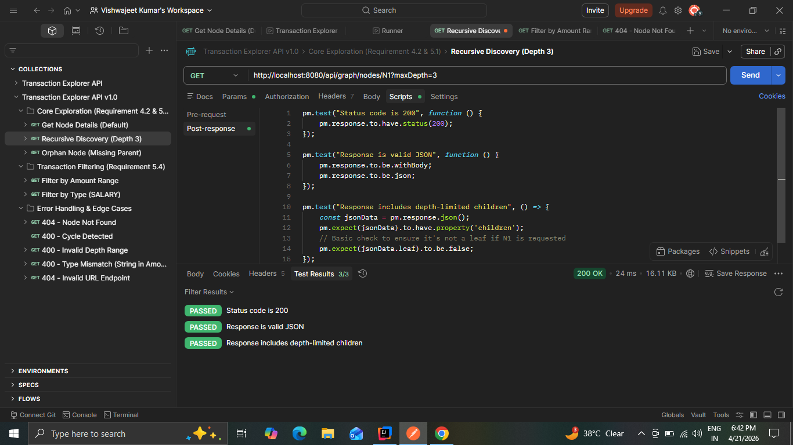
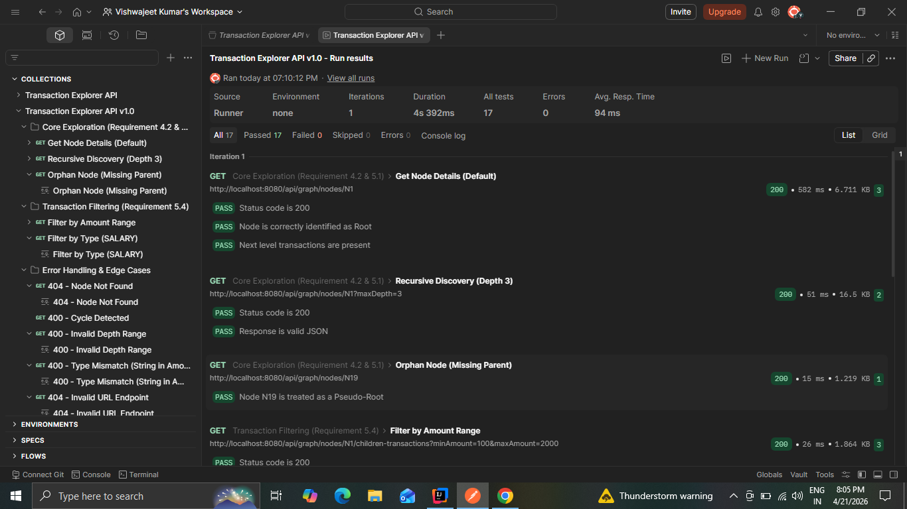
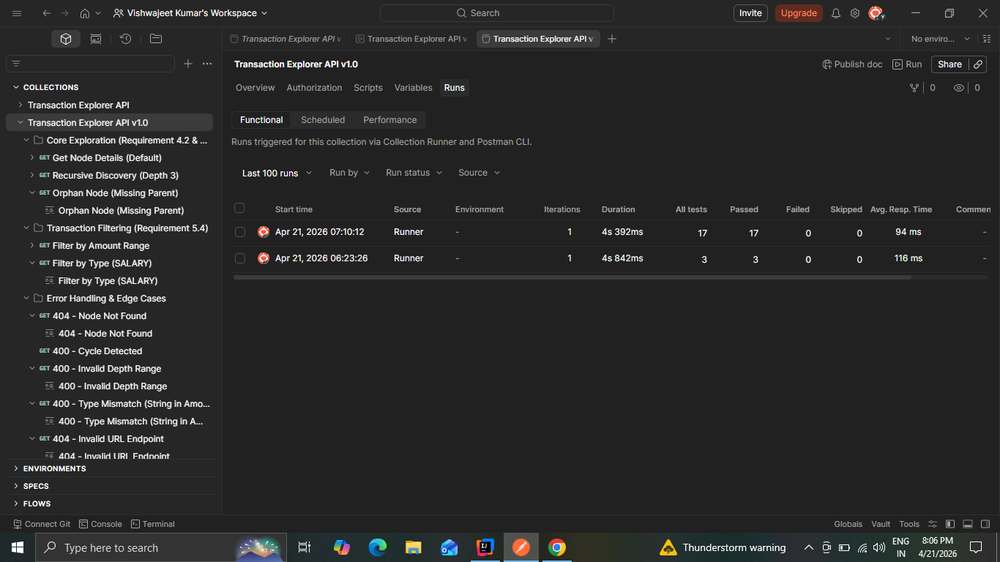

# Transaction Explorer API 🚀

A high-performance Spring Boot API designed to navigate and analyze hierarchical transaction data. This project implements graph traversal logic to classify nodes (Root, Leaf, Orphan) and detect cycles within financial data structures.

---

## ✨ Key Features
* **Graph Classification:** Automatically identifies **Root**, **Leaf**, and **"Pseudo-Root" (Orphan)** nodes.
* **Recursive Discovery:** Traverses the graph to a specified `maxDepth` to retrieve sub-hierarchies.
* **Cycle Detection:** Implements a **Depth-First Search (DFS)** algorithm to catch and prevent infinite loops in data.
* **Transaction Filtering:** Built-in filtering for transaction amounts and types (e.g., SALARY).
* **Input Validation:** Robust error handling for `maxDepth` constraints (0-5) with professional JSON error responses.

---

## 🛠️ Tech Stack
* **Java 17 / Spring Boot 3.x**
* **Maven** (Build Tool)
* **JUnit 5 / MockMvc** (Testing)
* **Postman** (Automated API Testing)
* **Docker** (Containerization)

---

## 📋 Getting Started

### 1. Clone & Run Locally
```bash
git clone https://github.com/vishwajeetkr96-hash/transaction-graph-api.git
cd transaction-explorer-api
./mvnw spring-boot:run
```
The API will be available at: 👉 **http://localhost:8080**

### 2. Docker Support 🐳
The project is fully containerized. To build and deploy:

```bash
# Build the JAR and the Image
mvn clean package
docker build -t transaction-explorer-api .

# Run the container
docker run -p 8080:8080 --name transaction-explorer transaction-explorer-api
```

---

## 🧪 Testing Suite

### Unit & Integration Tests
The project maintains high coverage across the service and controller layers.
```bash
./mvnw test
```

### Postman Automated Testing
A full test suite with **Automated Assertion Scripts** is included:
* **File:** `Transaction_Explorer_API.postman_collection.json`

**How to Import & Run:**
1.  Open **Postman** and click **Import**.
2.  Drag and drop the `.json` file from the project root.
3.  Use the **Collection Runner** to execute all tests. All tests are validated for **Schema Validation**, **Logic Verification**, and **Error Handling**.

---







## 📂 Project Structure
```text
transaction-explorer-api/
├── src/                        # Application source code
├── screenshots/                # Postman test result screenshots
├── Transaction_Explorer_API.postman_collection.json
├── DESIGN.md                   # Technical breakdown of DFS logic
├── Dockerfile                  # Containerization setup
└── README.md                   # Project documentation
```

---

## 📖 Documentation
For a deep dive into algorithm choices, complexity analysis, and how we handle orphan nodes, please refer to:
👉 **[DESIGN.md](./DESIGN.md)**

---

## 👨‍💻 Author
**Vishwajeet Kumar** GitHub: [vishwajeetkr96-hash](https://github.com/vishwajeetkr96-hash)

---
